td {background-color:\#F9F9F9; vertical-align:top}
td img{width:100%}
.book .book-body .page-wrapper .page-inner section.normal table td:nth-child(1){width:50px;padding-right:2px;padding-left: 2px;vertical-align: top}
.book .book-body .page-wrapper .page-inner section.normal table td:nth-child(2){width:575px;}
.book .book-body .page-wrapper .page-inner section.normal table td:nth-child(3){width:175px;padding:5px;vertical-align: middle}
.book .book-body .page-wrapper .page-inner section.normal table{box-shadow: 2px 2px 2px \#BBBBBB}
/\*td:nth-child(3) img{box-shadow: 2px 2px 5px \#BBBBBB}\*/
thead {display: none}
INDEX OF NODES
==============

This index provides additional information on all the nodes used in this primer, as well as other components you might find useful. This is just an introduction to some of the 500 nodes available in Dynamo.
--------------------------------------------------------------------------------------------------------------------------------------------------------------------------------------------------------------

Bulitin Functions
-----------------

<table>
<colgroup>
<col width="33%" />
<col width="33%" />
<col width="33%" />
</colgroup>
<tbody>
<tr class="odd">
<td align="left"></td>
<td align="left"><strong>Count</strong> 
</td>
<td align="left"></td>
</tr>
<tr class="even">
<td align="left"></td>
<td align="left"><strong>Flatten</strong> 
</td>
<td align="left"></td>
</tr>
<tr class="odd">
<td align="left"></td>
<td align="left"><strong>Map</strong> 
</td>
<td align="left"></td>
</tr>
</tbody>
</table>

Core
----

### Core.Color

<table>
<colgroup>
<col width="33%" />
<col width="33%" />
<col width="33%" />
</colgroup>
<tbody>
<tr class="odd">
<td align="left"></td>
<td align="left">CREATE</td>
<td align="left"></td>
</tr>
<tr class="even">
<td align="left"></td>
<td align="left"><strong>Color.ByARGB</strong> 
</td>
<td align="left">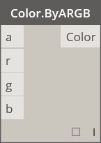</td>
</tr>
<tr class="odd">
<td align="left"></td>
<td align="left"><strong>Color Range</strong> 
</td>
<td align="left">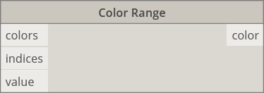</td>
</tr>
<tr class="even">
<td align="left"></td>
<td align="left">ACTIONS</td>
<td align="left"></td>
</tr>
<tr class="odd">
<td align="left"></td>
<td align="left"><strong>Color.Brightness</strong> 
</td>
<td align="left"></td>
</tr>
<tr class="even">
<td align="left"></td>
<td align="left"><strong>Color.Components</strong> 
</td>
<td align="left">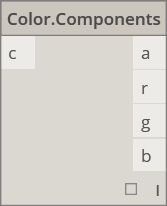</td>
</tr>
<tr class="odd">
<td align="left"></td>
<td align="left"><strong>Color.Saturation</strong> 
</td>
<td align="left">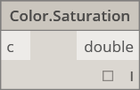</td>
</tr>
<tr class="even">
<td align="left"></td>
<td align="left"><strong>Color.Hue</strong> 
</td>
<td align="left"></td>
</tr>
<tr class="odd">
<td align="left"></td>
<td align="left">QUERY</td>
<td align="left"></td>
</tr>
<tr class="even">
<td align="left"></td>
<td align="left"><strong>Color.Alpha</strong> 
</td>
<td align="left"></td>
</tr>
<tr class="odd">
<td align="left"></td>
<td align="left"><strong>Color.Blue</strong> 
</td>
<td align="left">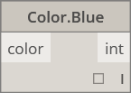</td>
</tr>
<tr class="even">
<td align="left"></td>
<td align="left"><strong>Color.Green</strong> 
</td>
<td align="left"></td>
</tr>
<tr class="odd">
<td align="left"></td>
<td align="left"><strong>Color.Red</strong> 
</td>
<td align="left"></td>
</tr>
</tbody>
</table>

### Core.Display

<table>
<tbody>
<tr class="odd">
<td align="left"></td>
<td align="left">CREATE</td>
<td align="left"></td>
</tr>
<tr class="even">
<td align="left"></td>
<td align="left"><strong>Display.ByGeometryColor</strong> 
</td>
<td align="left">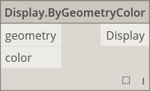</td>
</tr>
</tbody>
</table>

### Core.Input

<table>
<colgroup>
<col width="33%" />
<col width="33%" />
<col width="33%" />
</colgroup>
<tbody>
<tr class="odd">
<td align="left"></td>
<td align="left">ACTIONS</td>
<td align="left"></td>
</tr>
<tr class="even">
<td align="left"></td>
<td align="left"><strong>Boolean</strong> 
</td>
<td align="left">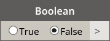</td>
</tr>
<tr class="odd">
<td align="left"></td>
<td align="left"><strong>Code Block</strong> 
</td>
<td align="left"></td>
</tr>
<tr class="even">
<td align="left"></td>
<td align="left"><strong>Directory Path</strong> 
</td>
<td align="left">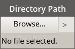</td>
</tr>
<tr class="odd">
<td align="left"></td>
<td align="left"><strong>File Path</strong> 
</td>
<td align="left"></td>
</tr>
<tr class="even">
<td align="left"></td>
<td align="left"><strong>Integer Slider</strong> 
</td>
<td align="left">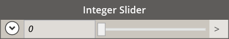</td>
</tr>
<tr class="odd">
<td align="left"></td>
<td align="left"><strong>Number</strong> 
</td>
<td align="left"></td>
</tr>
<tr class="even">
<td align="left"></td>
<td align="left"><strong>Number Slider</strong> 
</td>
<td align="left"></td>
</tr>
<tr class="odd">
<td align="left"></td>
<td align="left"><strong>String</strong> 
</td>
<td align="left"></td>
</tr>
</tbody>
</table>

### Core.List

<table>
<colgroup>
<col width="33%" />
<col width="33%" />
<col width="33%" />
</colgroup>
<tbody>
<tr class="odd">
<td align="left"></td>
<td align="left">CREATE</td>
<td align="left"></td>
</tr>
<tr class="even">
<td align="left"></td>
<td align="left"><strong>List.Create</strong> 
</td>
<td align="left"></td>
</tr>
<tr class="odd">
<td align="left"></td>
<td align="left"><strong>List.Combine</strong> 
</td>
<td align="left"></td>
</tr>
<tr class="even">
<td align="left"></td>
<td align="left"><strong>Number Range</strong> 
</td>
<td align="left">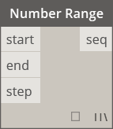</td>
</tr>
<tr class="odd">
<td align="left"></td>
<td align="left"><strong>Number Sequence</strong> 
</td>
<td align="left"></td>
</tr>
<tr class="even">
<td align="left"></td>
<td align="left">ACTIONS</td>
<td align="left"></td>
</tr>
<tr class="odd">
<td align="left"></td>
<td align="left"><strong>List.Chop</strong> 
</td>
<td align="left">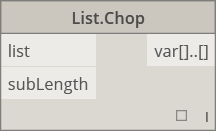</td>
</tr>
<tr class="even">
<td align="left"></td>
<td align="left"><strong>List.Count</strong> 
</td>
<td align="left"></td>
</tr>
<tr class="odd">
<td align="left"></td>
<td align="left"><strong>List.Flatten</strong> 
</td>
<td align="left"></td>
</tr>
<tr class="even">
<td align="left"></td>
<td align="left"><strong>List.FilterByBoolMask</strong> 
</td>
<td align="left"></td>
</tr>
<tr class="odd">
<td align="left"></td>
<td align="left"><strong>List.GetItemAtIndex</strong> 
</td>
<td align="left"></td>
</tr>
<tr class="even">
<td align="left"></td>
<td align="left"><strong>List.Map</strong> 
</td>
<td align="left"></td>
</tr>
<tr class="odd">
<td align="left"></td>
<td align="left"><strong>List.Reverse</strong> 
</td>
<td align="left"></td>
</tr>
<tr class="even">
<td align="left"></td>
<td align="left"><strong>List.ReplaceItemAtIndex</strong> 
</td>
<td align="left"></td>
</tr>
<tr class="odd">
<td align="left"></td>
<td align="left"><strong>List.ShiftIndices</strong> 
</td>
<td align="left"></td>
</tr>
<tr class="even">
<td align="left"></td>
<td align="left"><strong>List.TakeEveryNthItem</strong> 
</td>
<td align="left">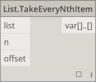</td>
</tr>
<tr class="odd">
<td align="left"></td>
<td align="left"><strong>List.Transpose</strong> 
</td>
<td align="left">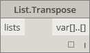</td>
</tr>
</tbody>
</table>

### Core.Logic

<table>
<colgroup>
<col width="33%" />
<col width="33%" />
<col width="33%" />
</colgroup>
<tbody>
<tr class="odd">
<td align="left"></td>
<td align="left">ACTIONS</td>
<td align="left"></td>
</tr>
<tr class="even">
<td align="left"></td>
<td align="left"><strong>If</strong> 
</td>
<td align="left"></td>
</tr>
</tbody>
</table>

### Core.Math

<table>
<colgroup>
<col width="33%" />
<col width="33%" />
<col width="33%" />
</colgroup>
<tbody>
<tr class="odd">
<td align="left"></td>
<td align="left">ACTIONS</td>
<td align="left"></td>
</tr>
<tr class="even">
<td align="left"></td>
<td align="left"><strong>Math.Cos</strong> 
</td>
<td align="left"></td>
</tr>
<tr class="odd">
<td align="left"></td>
<td align="left"><strong>Math.DegreesToRadians</strong> 
</td>
<td align="left"></td>
</tr>
<tr class="even">
<td align="left">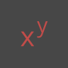</td>
<td align="left"><strong>Math.Pow</strong> 
</td>
<td align="left"></td>
</tr>
<tr class="odd">
<td align="left"></td>
<td align="left"><strong>Math.RadiansToDegrees</strong> 
</td>
<td align="left"></td>
</tr>
<tr class="even">
<td align="left"></td>
<td align="left"><strong>Math.RemapRange</strong> 
</td>
<td align="left"></td>
</tr>
<tr class="odd">
<td align="left"></td>
<td align="left"><strong>Math.Sin</strong> 
</td>
<td align="left"></td>
</tr>
</tbody>
</table>

### Core.Object

<table>
<tbody>
<tr class="odd">
<td align="left"></td>
<td align="left">ACTIONS</td>
<td align="left"></td>
</tr>
<tr class="even">
<td align="left"></td>
<td align="left"><strong>Object.IsNull</strong> 
</td>
<td align="left">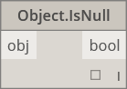</td>
</tr>
</tbody>
</table>

### Core.Scripting

<table>
<colgroup>
<col width="33%" />
<col width="33%" />
<col width="33%" />
</colgroup>
<tbody>
<tr class="odd">
<td align="left"></td>
<td align="left">ACTIONS</td>
<td align="left"></td>
</tr>
<tr class="even">
<td align="left"></td>
<td align="left"><strong>Formula</strong> 
</td>
<td align="left"></td>
</tr>
</tbody>
</table>

### Core.String

<table>
<colgroup>
<col width="33%" />
<col width="33%" />
<col width="33%" />
</colgroup>
<tbody>
<tr class="odd">
<td align="left"></td>
<td align="left">ACTIONS</td>
<td align="left"></td>
</tr>
<tr class="even">
<td align="left"></td>
<td align="left"><strong>String.Concat</strong> 
</td>
<td align="left">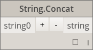</td>
</tr>
<tr class="odd">
<td align="left"></td>
<td align="left"><strong>String.Contains</strong> 
</td>
<td align="left"></td>
</tr>
<tr class="even">
<td align="left"></td>
<td align="left"><strong>String.Join</strong> 
</td>
<td align="left"></td>
</tr>
<tr class="odd">
<td align="left"></td>
<td align="left"><strong>String.Split</strong> 
</td>
<td align="left">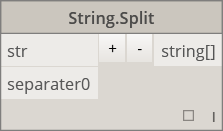</td>
</tr>
<tr class="even">
<td align="left"></td>
<td align="left"><strong>String.ToNumber</strong> 
</td>
<td align="left"></td>
</tr>
</tbody>
</table>

### Core.View

<table>
<tbody>
<tr class="odd">
<td align="left"></td>
<td align="left">ACTIONS</td>
<td align="left"></td>
</tr>
<tr class="even">
<td align="left"></td>
<td align="left"><strong>View.Watch</strong> 
</td>
<td align="left"></td>
</tr>
<tr class="odd">
<td align="left"></td>
<td align="left"><strong>View.Watch 3D</strong> 
</td>
<td align="left">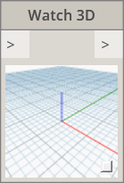</td>
</tr>
</tbody>
</table>

Geometry
--------

### Geometry.Circle

<table>
<colgroup>
<col width="33%" />
<col width="33%" />
<col width="33%" />
</colgroup>
<tbody>
<tr class="odd">
<td align="left"></td>
<td align="left">CREATE</td>
<td align="left"></td>
</tr>
<tr class="even">
<td align="left"></td>
<td align="left"><strong>Circle.ByCenterPointRadius</strong> 
</td>
<td align="left"></td>
</tr>
<tr class="odd">
<td align="left"></td>
<td align="left"><strong>Circle.ByPlaneRadius</strong> 
</td>
<td align="left"></td>
</tr>
</tbody>
</table>

### Geometry.CoordinateSystem

<table>
<colgroup>
<col width="33%" />
<col width="33%" />
<col width="33%" />
</colgroup>
<tbody>
<tr class="odd">
<td align="left"></td>
<td align="left">CREATE</td>
<td align="left"></td>
</tr>
<tr class="even">
<td align="left"></td>
<td align="left"><strong>CoordinateSystem.ByOrigin</strong> 
</td>
<td align="left"></td>
</tr>
<tr class="odd">
<td align="left"></td>
<td align="left"><strong>CoordinateSystem.ByCyclindricalCoordinates</strong> 
</td>
<td align="left">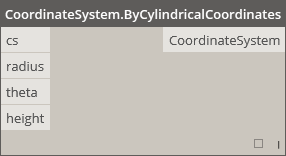</td>
</tr>
</tbody>
</table>

### Geometry.Cuboid

<table>
<colgroup>
<col width="33%" />
<col width="33%" />
<col width="33%" />
</colgroup>
<tbody>
<tr class="odd">
<td align="left"></td>
<td align="left">CREATE</td>
<td align="left"></td>
</tr>
<tr class="even">
<td align="left"></td>
<td align="left"><strong>Cuboid.ByLengths</strong> (origin) 
</td>
<td align="left">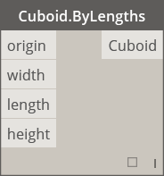</td>
</tr>
</tbody>
</table>

### Geometry.Curve

<table>
<colgroup>
<col width="33%" />
<col width="33%" />
<col width="33%" />
</colgroup>
<tbody>
<tr class="odd">
<td align="left"></td>
<td align="left">ACTIONS</td>
<td align="left"></td>
</tr>
<tr class="even">
<td align="left"></td>
<td align="left"><strong>Curve.Extrude</strong> (distance) 
</td>
<td align="left"></td>
</tr>
<tr class="odd">
<td align="left"></td>
<td align="left"><strong>Curve.PointAtParameter</strong> 
</td>
<td align="left">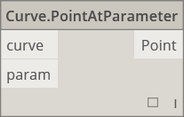</td>
</tr>
</tbody>
</table>

### Geometry.Geometry

<table>
<colgroup>
<col width="33%" />
<col width="33%" />
<col width="33%" />
</colgroup>
<tbody>
<tr class="odd">
<td align="left"></td>
<td align="left">ACTIONS</td>
<td align="left"></td>
</tr>
<tr class="even">
<td align="left"></td>
<td align="left"><strong>Geometry.DistanceTo</strong> 
</td>
<td align="left"></td>
</tr>
<tr class="odd">
<td align="left"></td>
<td align="left"><strong>Geometry.Explode</strong> 
</td>
<td align="left"></td>
</tr>
<tr class="even">
<td align="left"></td>
<td align="left"><strong>Geometry.ImportFromSAT</strong> 
</td>
<td align="left"></td>
</tr>
<tr class="odd">
<td align="left">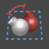</td>
<td align="left"><strong>Geometry.Rotate</strong> (basePlane) 
</td>
<td align="left"></td>
</tr>
<tr class="even">
<td align="left"></td>
<td align="left"><strong>Geometry.Translate</strong> 
</td>
<td align="left"></td>
</tr>
</tbody>
</table>

### Geometry.Line

<table>
<colgroup>
<col width="33%" />
<col width="33%" />
<col width="33%" />
</colgroup>
<tbody>
<tr class="odd">
<td align="left"></td>
<td align="left">CREATE</td>
<td align="left"></td>
</tr>
<tr class="even">
<td align="left"></td>
<td align="left"><strong>Line.ByBestFitThroughPoints</strong> 
</td>
<td align="left"></td>
</tr>
<tr class="odd">
<td align="left"></td>
<td align="left"><strong>Line.ByStartPointDirectionLength</strong> 
</td>
<td align="left"></td>
</tr>
<tr class="even">
<td align="left"></td>
<td align="left"><strong>Line.ByStartPointEndPoint</strong> 
</td>
<td align="left"></td>
</tr>
<tr class="odd">
<td align="left"></td>
<td align="left"><strong>Line.ByTangency</strong> 
</td>
<td align="left"></td>
</tr>
<tr class="even">
<td align="left"></td>
<td align="left">QUERY</td>
<td align="left"></td>
</tr>
<tr class="odd">
<td align="left"></td>
<td align="left"><strong>Line.Direction</strong> 
</td>
<td align="left"></td>
</tr>
</tbody>
</table>

### Geometry.NurbsCurve

<table>
<colgroup>
<col width="33%" />
<col width="33%" />
<col width="33%" />
</colgroup>
<tbody>
<tr class="odd">
<td align="left"></td>
<td align="left">Create</td>
<td align="left"></td>
</tr>
<tr class="even">
<td align="left"></td>
<td align="left"><strong>NurbsCurve.ByControlPoints</strong> 
</td>
<td align="left">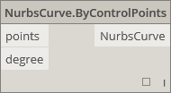</td>
</tr>
<tr class="odd">
<td align="left"></td>
<td align="left"><strong>NurbsCurve.ByPoints</strong> 
</td>
<td align="left">qcomm</td>
</tr>
</tbody>
</table>

### Geometry.NurbsSurface

<table>
<colgroup>
<col width="33%" />
<col width="33%" />
<col width="33%" />
</colgroup>
<tbody>
<tr class="odd">
<td align="left"></td>
<td align="left">Create</td>
<td align="left"></td>
</tr>
<tr class="even">
<td align="left"></td>
<td align="left"><strong>NurbsSurface.ByControlPoints</strong> 
</td>
<td align="left"></td>
</tr>
<tr class="odd">
<td align="left"></td>
<td align="left"><strong>NurbsSurface.ByPoints</strong> 
</td>
<td align="left"></td>
</tr>
</tbody>
</table>

### Geometry.Plane

<table>
<colgroup>
<col width="33%" />
<col width="33%" />
<col width="33%" />
</colgroup>
<tbody>
<tr class="odd">
<td align="left"></td>
<td align="left">CREATE</td>
<td align="left"></td>
</tr>
<tr class="even">
<td align="left"></td>
<td align="left"><strong>Plane.ByOriginNormal</strong> 
</td>
<td align="left"></td>
</tr>
<tr class="odd">
<td align="left"></td>
<td align="left"><strong>Plane.XY</strong> 
</td>
<td align="left"></td>
</tr>
</tbody>
</table>

### Geometry.Point

<table>
<colgroup>
<col width="33%" />
<col width="33%" />
<col width="33%" />
</colgroup>
<tbody>
<tr class="odd">
<td align="left"></td>
<td align="left">CREATE</td>
<td align="left"></td>
</tr>
<tr class="even">
<td align="left">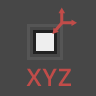</td>
<td align="left"><strong>Point.ByCartesianCoordinates</strong> 
</td>
<td align="left"></td>
</tr>
<tr class="odd">
<td align="left"></td>
<td align="left"><strong>Point.ByCoordinates</strong> (2d) 
</td>
<td align="left"></td>
</tr>
<tr class="even">
<td align="left"></td>
<td align="left"><strong>Point.ByCoordinates</strong> (3d) 
</td>
<td align="left">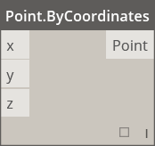</td>
</tr>
<tr class="odd">
<td align="left">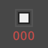</td>
<td align="left"><strong>Point.Origin</strong> 
</td>
<td align="left">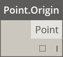</td>
</tr>
<tr class="even">
<td align="left"></td>
<td align="left">ACTIONS</td>
<td align="left"></td>
</tr>
<tr class="odd">
<td align="left"></td>
<td align="left"><strong>Point.Add</strong> 
</td>
<td align="left"></td>
</tr>
<tr class="even">
<td align="left"></td>
<td align="left">QUERY</td>
<td align="left"></td>
</tr>
<tr class="odd">
<td align="left">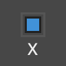</td>
<td align="left"><strong>Point.X</strong> 
</td>
<td align="left"></td>
</tr>
<tr class="even">
<td align="left"></td>
<td align="left"><strong>Point.Y</strong> 
</td>
<td align="left"></td>
</tr>
<tr class="odd">
<td align="left"></td>
<td align="left"><strong>Point.Z</strong> 
</td>
<td align="left"></td>
</tr>
</tbody>
</table>

### Geometry.Polycurve

<table>
<colgroup>
<col width="33%" />
<col width="33%" />
<col width="33%" />
</colgroup>
<tbody>
<tr class="odd">
<td align="left"></td>
<td align="left">CREATE</td>
<td align="left"></td>
</tr>
<tr class="even">
<td align="left"></td>
<td align="left"><strong>Polycurve.ByPoints</strong> 
</td>
<td align="left"></td>
</tr>
</tbody>
</table>

### Geometry.Rectangle

<table>
<colgroup>
<col width="33%" />
<col width="33%" />
<col width="33%" />
</colgroup>
<tbody>
<tr class="odd">
<td align="left"></td>
<td align="left">CREATE</td>
<td align="left"></td>
</tr>
<tr class="even">
<td align="left">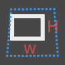</td>
<td align="left"><strong>Rectangle.ByWidthLength</strong> (Plane) 
</td>
<td align="left">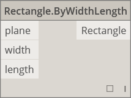</td>
</tr>
</tbody>
</table>

### Geometry.Sphere

<table>
<colgroup>
<col width="33%" />
<col width="33%" />
<col width="33%" />
</colgroup>
<tbody>
<tr class="odd">
<td align="left"></td>
<td align="left">CREATE</td>
<td align="left"></td>
</tr>
<tr class="even">
<td align="left"></td>
<td align="left"><strong>Sphere.ByCenterPointRadius</strong> 
</td>
<td align="left"></td>
</tr>
</tbody>
</table>

### Geometry.Surface

<table>
<colgroup>
<col width="33%" />
<col width="33%" />
<col width="33%" />
</colgroup>
<tbody>
<tr class="odd">
<td align="left"></td>
<td align="left">CREATE</td>
<td align="left"></td>
</tr>
<tr class="even">
<td align="left"></td>
<td align="left"><strong>Surface.ByLoft</strong> 
</td>
<td align="left">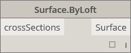</td>
</tr>
<tr class="odd">
<td align="left"></td>
<td align="left"><strong>Surface.ByPatch</strong> 
</td>
<td align="left">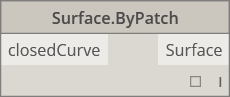</td>
</tr>
<tr class="even">
<td align="left"></td>
<td align="left">ACTIONS</td>
<td align="left"></td>
</tr>
<tr class="odd">
<td align="left"></td>
<td align="left"><strong>Surface.Offset</strong> 
</td>
<td align="left">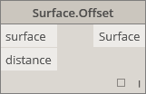</td>
</tr>
<tr class="even">
<td align="left"></td>
<td align="left"><strong>Surface.PointAtParameter</strong> 
</td>
<td align="left"></td>
</tr>
<tr class="odd">
<td align="left"></td>
<td align="left"><strong>Surface.Thicken</strong> 
</td>
<td align="left">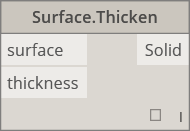</td>
</tr>
</tbody>
</table>

### Geometry.UV

<table>
<tbody>
<tr class="odd">
<td align="left"></td>
<td align="left">CREATE</td>
<td align="left"></td>
</tr>
<tr class="even">
<td align="left"></td>
<td align="left"><strong>UV.ByCoordinates</strong> 
</td>
<td align="left"></td>
</tr>
</tbody>
</table>

### Geometry.Vector

<table>
<tbody>
<tr class="odd">
<td align="left"></td>
<td align="left">CREATE</td>
<td align="left"></td>
</tr>
<tr class="even">
<td align="left"></td>
<td align="left"><strong>Vector.ByCoordinates</strong> 
</td>
<td align="left"></td>
</tr>
<tr class="odd">
<td align="left"></td>
<td align="left"><strong>Vector.XAxis</strong> 
</td>
<td align="left">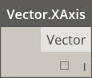</td>
</tr>
<tr class="even">
<td align="left"></td>
<td align="left"><strong>Vector.YAxis</strong> 
</td>
<td align="left"></td>
</tr>
<tr class="odd">
<td align="left"></td>
<td align="left"><strong>Vector.ZAxis</strong> 
</td>
<td align="left">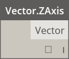</td>
</tr>
<tr class="even">
<td align="left"></td>
<td align="left">ACTIONS</td>
<td align="left"></td>
</tr>
<tr class="odd">
<td align="left"></td>
<td align="left"><strong>Vector.Normalized</strong> 
</td>
<td align="left"></td>
</tr>
</tbody>
</table>

Operators
---------

<table>
<colgroup>
<col width="33%" />
<col width="33%" />
<col width="33%" />
</colgroup>
<tbody>
<tr class="odd">
<td align="left"></td>
<td align="left"><strong>+</strong> 
</td>
<td align="left"></td>
</tr>
<tr class="even">
<td align="left"></td>
<td align="left"><strong>-</strong> 
</td>
<td align="left">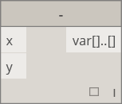</td>
</tr>
<tr class="odd">
<td align="left"></td>
<td align="left"><strong>*</strong> 
</td>
<td align="left"></td>
</tr>
<tr class="even">
<td align="left"></td>
<td align="left"><strong>/</strong> 
</td>
<td align="left"></td>
</tr>
<tr class="odd">
<td align="left"></td>
<td align="left"><strong>%</strong> 
</td>
<td align="left"></td>
</tr>
<tr class="even">
<td align="left"></td>
<td align="left"><strong>&lt;</strong> 
</td>
<td align="left"></td>
</tr>
<tr class="odd">
<td align="left"></td>
<td align="left"><strong>&gt;</strong> 
</td>
<td align="left"></td>
</tr>
<tr class="even">
<td align="left"></td>
<td align="left"><strong>==</strong> 
</td>
<td align="left"></td>
</tr>
</tbody>
</table>

