Data
====

Types
-----

### Numbers

<table>
<thead>
<tr class="header">
<th align="left">Icon</th>
<th align="left">Name</th>
<th align="left">Inputs</th>
<th align="left">Outputs</th>
</tr>
</thead>
<tbody>
<tr class="odd">
<td align="left">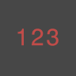</td>
<td align="left">Number</td>
<td align="left">Number Box</td>
<td align="left">double</td>
</tr>
</tbody>
</table>

Simply put, a number node allows one to add a number to the canvas by typing it in the number box. This can be an integer, decimal, negative number, etc. There are other options for adding numbers to the canvas, including sliders, which we'll demonstrate in the exercise at the end of this section. \#\#\#\# Booleans | Icon | Name | Inputs | Outputs | | --- | --- | --- | --- | |  | Boolean | True/False | boolean | Numeric variables can store a whole range of different numbers. Boolean variables can only store two values referred to as Yes or No, True or False, 1 or 0. Obviously we never use booleans to perform calculations because of their limited range. We use booleans to evaluate conditions. \#\#\#\# Strings | Icon | Name | Inputs | Outputs | | --- | --- | --- | --- | |  | String | Text Box | string | A string is programming lingo for text. We know that number can drive parameters, and we can do the same with text, which we demonstrate in section 4.4. \#\# Geometry  \#\#\#\#\#Points

<table>
<thead>
<tr class="header">
<th align="left">Icon</th>
<th align="left">Name/Syntax</th>
<th align="left">Inputs</th>
<th align="left">Outputs</th>
</tr>
</thead>
<tbody>
<tr class="odd">
<td align="left">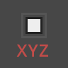</td>
<td align="left">Point.ByCoordinates</td>
<td align="left">x,y,z</td>
<td align="left">Point</td>
</tr>
<tr class="even">
<td align="left"></td>
<td align="left">Point.ByCylindricalCoordinates</td>
<td align="left">cs,angle,elevation,radius</td>
<td align="left">Point</td>
</tr>
<tr class="odd">
<td align="left">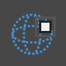</td>
<td align="left">Point.BySphericalCoordinates</td>
<td align="left">cs,phi,theta,radius</td>
<td align="left">Point</td>
</tr>
</tbody>
</table>

A point is a location in space. For this primer, our coordinate system is X,Y, and Z. A point has a value for X, a value for Y, and a value for Z.

#### Vectors

<table>
<thead>
<tr class="header">
<th align="left">Icon</th>
<th align="left">Name/Syntax</th>
<th align="left">Inputs</th>
<th align="left">Outputs</th>
</tr>
</thead>
<tbody>
<tr class="odd">
<td align="left"></td>
<td align="left">Vector.ByCoordinates</td>
<td align="left">x,y,z</td>
<td align="left">Vector</td>
</tr>
<tr class="even">
<td align="left">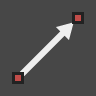</td>
<td align="left">Vector.ByTwoPoints</td>
<td align="left">start,end</td>
<td align="left">Vector</td>
</tr>
<tr class="odd">
<td align="left">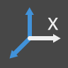</td>
<td align="left">Vector.XAxis</td>
<td align="left">none</td>
<td align="left">Vector</td>
</tr>
<tr class="even">
<td align="left">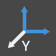</td>
<td align="left">Vector.YAxis</td>
<td align="left">none</td>
<td align="left">Vector</td>
</tr>
<tr class="odd">
<td align="left">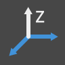</td>
<td align="left">Vector.ZAxis</td>
<td align="left">none</td>
<td align="left">Vector</td>
</tr>
</tbody>
</table>

A vector is a geometric quantity describing Direction and Magnitude. Vectors are abstract; ie. they represent a quantity, not a geometrical element.

#### Planes

<table>
<thead>
<tr class="header">
<th align="left">Icon</th>
<th align="left">Name/Syntax</th>
<th align="left">Inputs</th>
<th align="left">Outputs</th>
</tr>
</thead>
<tbody>
<tr class="odd">
<td align="left"></td>
<td align="left">Vector.ByCoordinates</td>
<td align="left">p1,p2,p3</td>
<td align="left">Plane</td>
</tr>
<tr class="even">
<td align="left"></td>
<td align="left">Vector.ByTwoPoints</td>
<td align="left">origin,normal</td>
<td align="left">Plane</td>
</tr>
<tr class="odd">
<td align="left">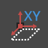</td>
<td align="left">Plane.XY</td>
<td align="left">none</td>
<td align="left">Plane</td>
</tr>
<tr class="even">
<td align="left">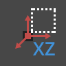</td>
<td align="left">Plane.XZ</td>
<td align="left">none</td>
<td align="left">Plane</td>
</tr>
<tr class="odd">
<td align="left">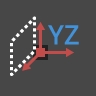</td>
<td align="left">Plane.YZ</td>
<td align="left">none</td>
<td align="left">Plane</td>
</tr>
</tbody>
</table>

Planes are “Flat” and extend infinitely in two directions, defining a local coordinate system.

#### Nurbs

<table>
<thead>
<tr class="header">
<th align="left">Icon</th>
<th align="left">Name/Syntax</th>
<th align="left">Inputs</th>
<th align="left">Outputs</th>
</tr>
</thead>
<tbody>
<tr class="odd">
<td align="left"></td>
<td align="left">NurbsSurface.ByControlPoints</td>
<td align="left">ControlVertices,uDegree,vDegree</td>
<td align="left">NurbsSurface</td>
</tr>
<tr class="even">
<td align="left">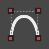</td>
<td align="left">NurbsCurve.ByControlPoints</td>
<td align="left">points</td>
<td align="left">NurbsCurve</td>
</tr>
</tbody>
</table>

NURBS (non-uniform rational B-splines) are mathematical representations that can accurately model any shape from a simple 2D line, circle, arc, or box to the most complex 3D free-form organic surface or solid. They are created with rational algorithms and are infinitely differentiable.

#### Meshes

<table>
<thead>
<tr class="header">
<th align="left">Icon</th>
<th align="left">Name/Syntax</th>
<th align="left">Inputs</th>
<th align="left">Outputs</th>
</tr>
</thead>
<tbody>
<tr class="odd">
<td align="left"></td>
<td align="left">Mesh.ByPointsFaceIndices</td>
<td align="left">vertexPositions,indices</td>
<td align="left">Mesh</td>
</tr>
</tbody>
</table>

A mesh is a collection of vertices, edges and faces which define a polyhedral object. Meshes are often used for rendering and animation, and are generally 'lighter weight' than nurbs (meaning, they have smaller file sizes and render more quickly). The tradeoff is that meshes are limited in their resolution.

#### Meshes vs. Nurbs

Generally, we can say that Nurbs are to Meshes as Vectors are to Pixels. They are significantly different geometry types, and using the propery geometry type for surfaces is critical for parametric modeling and file management.

#### Surfaces

<table>
<colgroup>
<col width="25%" />
<col width="25%" />
<col width="25%" />
<col width="25%" />
</colgroup>
<thead>
<tr class="header">
<th align="left">Icon</th>
<th align="left">Name/Syntax</th>
<th align="left">Inputs</th>
<th align="left">Outputs</th>
</tr>
</thead>
<tbody>
<tr class="odd">
<td align="left"></td>
<td align="left">Surface.ByLoft</td>
<td align="left">crossSections</td>
<td align="left">Surface</td>
</tr>
<tr class="even">
<td align="left"></td>
<td align="left">Surface.ByPatch</td>
<td align="left">closedCurve</td>
<td align="left">Surface</td>
</tr>
<tr class="odd">
<td align="left"></td>
<td align="left">Surface.ByPerimeterPoints</td>
<td align="left">points</td>
<td align="left">Surface</td>
</tr>
<tr class="even">
<td align="left"></td>
<td align="left">Surface.BySweep</td>
<td align="left">profile,path</td>
<td align="left">Surface</td>
</tr>
<tr class="odd">
<td align="left">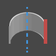</td>
<td align="left">Surface.ByRevolve</td>
<td align="left">profile,axisOrigin,axisDirection,startAngle,sweepAngle</td>
<td align="left">Surface</td>
</tr>
</tbody>
</table>

A surface is two-dimensional topological manifold. Rather than deciphering what that means, let's just saw a surface is geometry that does not have thickness. This is how a surface is different from a solid.

#### Solids

<table>
<colgroup>
<col width="25%" />
<col width="25%" />
<col width="25%" />
<col width="25%" />
</colgroup>
<thead>
<tr class="header">
<th align="left">Icon</th>
<th align="left">Name/Syntax</th>
<th align="left">Inputs</th>
<th align="left">Outputs</th>
</tr>
</thead>
<tbody>
<tr class="odd">
<td align="left">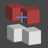</td>
<td align="left">Solid.ByUnion</td>
<td align="left">solids</td>
<td align="left">Solid</td>
</tr>
<tr class="even">
<td align="left">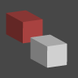</td>
<td align="left">Solid.ByJoinedSurfaces</td>
<td align="left">facesOfSolid</td>
<td align="left">Solid</td>
</tr>
<tr class="odd">
<td align="left">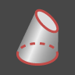</td>
<td align="left">Solid.ByLoft</td>
<td align="left">crossSections</td>
<td align="left">Solid</td>
</tr>
<tr class="even">
<td align="left">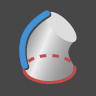</td>
<td align="left">Solid.BySweep</td>
<td align="left">profile,path</td>
<td align="left">Solid</td>
</tr>
<tr class="odd">
<td align="left">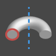</td>
<td align="left">Solid.ByRevolve</td>
<td align="left">profile,axisOrigin,axisDirection,startAngle,sweepAngle</td>
<td align="left">Solid</td>
</tr>
</tbody>
</table>

A solid is three-dimensional geometry. A solid has thickness and can exist in the real world, unlike surfaces, curves, vectors, and points (at least as far as we can see). In Dynamo, a solid can be defined as a collection of surfaces, called a polysurface.

#### "Null"

<table>
<thead>
<tr class="header">
<th align="left">Icon</th>
<th align="left">Name/Syntax</th>
<th align="left">Inputs</th>
<th align="left">Outputs</th>
</tr>
</thead>
<tbody>
<tr class="odd">
<td align="left"></td>
<td align="left">Object.IsNull</td>
<td align="left">obj</td>
<td align="left">bool</td>
</tr>
</tbody>
</table>

The 'null' object represents the absense of data. This is abstract, but you will likely come across this while working with visual programming. Testing for nulls and removing nulls from data structure is a crucial part to creating robust parametric models. \#\#\# 4.1.2 Hierarchy \#\#\#\# Item(s)

<table>
<thead>
<tr class="header">
<th align="left">Icon</th>
<th align="left">Name/Syntax</th>
<th align="left">Inputs</th>
<th align="left">Outputs</th>
</tr>
</thead>
<tbody>
<tr class="odd">
<td align="left">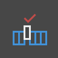</td>
<td align="left">List.GetItemAtIndex</td>
<td align="left">list,index</td>
<td align="left">var[]...[]</td>
</tr>
</tbody>
</table>

Simply put, an item represents one single value, whether by itself or as part of a list. This can be any data type.

### List(s)

<table>
<thead>
<tr class="header">
<th align="left">Icon</th>
<th align="left">Name/Syntax</th>
<th align="left">Inputs</th>
<th align="left">Outputs</th>
</tr>
</thead>
<tbody>
<tr class="odd">
<td align="left">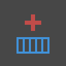</td>
<td align="left">List.Create</td>
<td align="left">index0, index1...</td>
<td align="left">list</td>
</tr>
</tbody>
</table>

