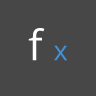

Math
====

Constants
=========

<table>
<thead>
<tr class="header">
<th align="left">Icon</th>
<th align="left">Name</th>
<th align="left">Syntax</th>
<th align="left">Inputs</th>
<th align="left">Outputs</th>
</tr>
</thead>
<tbody>
<tr class="odd">
<td align="left"></td>
<td align="left">Pi</td>
<td align="left">Math.PI</td>
<td align="left">none</td>
<td align="left">double</td>
</tr>
</tbody>
</table>

**Pi -** is a mathematical constant which represents the ratio of circle's circumference to its diameter. The value is commonly used in trigonmetric functions and is one of the more prevalent constants used in parametric modeling. A rounded value for *Pi* is *3.14159*.

<table>
<thead>
<tr class="header">
<th align="left">Icon</th>
<th align="left">Name</th>
<th align="left">Syntax</th>
<th align="left">Inputs</th>
<th align="left">Outputs</th>
</tr>
</thead>
<tbody>
<tr class="odd">
<td align="left"></td>
<td align="left">e</td>
<td align="left">Math.E</td>
<td align="left">none</td>
<td align="left">double</td>
</tr>
</tbody>
</table>

**e -** The number *e* is a mathematical constant which is based on the natural logarithm. Like *pi*, *e* is an irrational number which is commonly used in mathematics. The number is fundamental to growth prediction, and shows itself often in the fields of biology and economics. A rounded value for *e* is *2.71828*.

<table>
<thead>
<tr class="header">
<th align="left">Icon</th>
<th align="left">Name</th>
<th align="left">Syntax</th>
<th align="left">Inputs</th>
<th align="left">Outputs</th>
</tr>
</thead>
<tbody>
<tr class="odd">
<td align="left"></td>
<td align="left">phi</td>
<td align="left">Math.GoldenRatio</td>
<td align="left">none</td>
<td align="left">double</td>
</tr>
</tbody>
</table>

**φ: The Golden Ratio -** Another irrational constant, the golden ratio defines that two quantities are in the golden ratio if their ratio is the same as the ratio of their sum to the larger of the two quantities. This ratio appears often in geometry and biological systems, and is considered for a wide-range of applications ranging from the practical to the aesthetic. A rounded value for *φ* is *1.61804*.

Arithmetic Operators
====================

Operators are a set of components that use algebraic functions with two numeric input values, which result in one output value (addition, subtraction, multiplication, division, etc.).

You use the Math Operators to perform arithmetical actions on a set of numbers. These can be found under Operators&gt;Actions.

**Addition, Subtraction, Multiplication, Division -** These four operators are commonplace. Let's look at a few other operators which dive deeper:

<table>
<thead>
<tr class="header">
<th align="left">Icon</th>
<th align="left">Name</th>
<th align="left">Syntax</th>
<th align="left">Inputs</th>
<th align="left">Outputs</th>
</tr>
</thead>
<tbody>
<tr class="odd">
<td align="left"></td>
<td align="left">Add</td>
<td align="left">+</td>
<td align="left">var[]...[], var[]...[]</td>
<td align="left">var[]...[]</td>
</tr>
<tr class="even">
<td align="left"></td>
<td align="left">Subtract</td>
<td align="left">-</td>
<td align="left">var[]...[], var[]...[]</td>
<td align="left">var[]...[]</td>
</tr>
<tr class="odd">
<td align="left"></td>
<td align="left">Multiply</td>
<td align="left">*</td>
<td align="left">var[]...[], var[]...[]</td>
<td align="left">var[]...[]</td>
</tr>
<tr class="even">
<td align="left"></td>
<td align="left">Divide</td>
<td align="left">/</td>
<td align="left">var[]...[], var[]...[]</td>
<td align="left">var[]...[]</td>
</tr>
</tbody>
</table>

**Power -** Exponentiation, or the power operator, involves two numbers: the base number (x) and the power (y). The power of x to the y is defined as x repeatedly multiplied by itself for a total of y times.

| Icon | Name | Syntax| Inputs | Outputs | | --- | --- | --- | --- | --- | |  | Power | Math.Pow | number, power | var\[\]...\[\] | `2 ^ 3 = 2 x 2 x 2 = 8`

**Square Root -** The square root of x referes to the number z such that z^2=x. This operator is commonplace in a wide-range of geometric applications, most notably the [Pythagorean Theorem](http://en.wikipedia.org/wiki/Pythagorean_theorem).

| Icon | Name | Syntax| Inputs | Outputs | | --- | --- | --- | --- | --- | |  | Square Root | Math.Sqrt | number | double | `Sqrt(4) = 2`

**Absolute Value -**The absolute value of a number refers to its non-negative value. This operator comes in handy when parametrically, especially when a calculation concerns itself with scalar values rather than vectors (ie speed vs. velocity).

<table>
<thead>
<tr class="header">
<th align="left">Icon</th>
<th align="left">Name</th>
<th align="left">Syntax</th>
<th align="left">Inputs</th>
<th align="left">Outputs</th>
</tr>
</thead>
<tbody>
<tr class="odd">
<td align="left"></td>
<td align="left">Absolute Value</td>
<td align="left">Math.Abs</td>
<td align="left">number</td>
<td align="left">double</td>
</tr>
</tbody>
</table>

`|-10| = 10 and |10| = 10`

**Modulo -** The modulo operation refers to the remainder after a division.

<table>
<thead>
<tr class="header">
<th align="left">Icon</th>
<th align="left">Name</th>
<th align="left">Syntax</th>
<th align="left">Inputs</th>
<th align="left">Outputs</th>
</tr>
</thead>
<tbody>
<tr class="odd">
<td align="left"></td>
<td align="left">Modulo</td>
<td align="left">%</td>
<td align="left">var[]...[],var[]...[]</td>
<td align="left">var[]...[]</td>
</tr>
</tbody>
</table>

`11 % 6 = 5 (6 goes into 11 once, and has a remainder, or modulo, of 5)`

While this may not seem like much, the modulo is a great tool for creating patterns. The image below demonstrates how quickly one can parse out even and odd numbers with pure operations: 

**Ceiling, Floor, Round -** The ceiling, floor, and round operation refer to methods for reducing a decimal (or float) number to an integer.

| Icon | Name | Syntax| Inputs | Outputs | | --- | --- | --- | --- | --- | |  | Ceiling | Math.Ceiling | number | int | |  | Floor | Math.Floor | number | int | |  | Round | Math.Round | number | int | `11/6 = 1.833`

The floor represents the lower bound of the integer within the decimal range. `Floor(11/6) = Floor(1.833) = 1`

The ceiling represents the upper bound. `Ceil(11/6) = Ceil(1.833) = 2`

The round operations will 'round' to the closest number in the range. `Round(11/6) = Round(1.833) = 2`

Functions
=========

**Remap Range -**This is one of the most important functions in parametric modeling. The component maps a set of values in one domain into another domain, while maintaining the same distribution ratio.

<table>
<thead>
<tr class="header">
<th align="left">Icon</th>
<th align="left">Name</th>
<th align="left">Syntax</th>
<th align="left">Inputs</th>
<th align="left">Outputs</th>
</tr>
</thead>
<tbody>
<tr class="odd">
<td align="left"></td>
<td align="left">Remap Range</td>
<td align="left">Math.RemapRange</td>
<td align="left">numbers, newMin, newMax</td>
<td align="left">var[]...[]</td>
</tr>
</tbody>
</table>

**Average -** Determines the average (mean) of a list of numbers.

<table>
<thead>
<tr class="header">
<th align="left">Icon</th>
<th align="left">Name</th>
<th align="left">Syntax</th>
<th align="left">Inputs</th>
<th align="left">Outputs</th>
</tr>
</thead>
<tbody>
<tr class="odd">
<td align="left"></td>
<td align="left">Average</td>
<td align="left">Math.Average</td>
<td align="left">numbers</td>
<td align="left">double</td>
</tr>
</tbody>
</table>

**Sum -** Determines the sum of a list of numbers.

<table>
<thead>
<tr class="header">
<th align="left">Icon</th>
<th align="left">Name</th>
<th align="left">Syntax</th>
<th align="left">Inputs</th>
<th align="left">Outputs</th>
</tr>
</thead>
<tbody>
<tr class="odd">
<td align="left"></td>
<td align="left">Sum</td>
<td align="left">Math.Sum</td>
<td align="left">values</td>
<td align="left">double</td>
</tr>
</tbody>
</table>

**Random/RandomList -**Create a random number or a random list of numbers.

<table>
<thead>
<tr class="header">
<th align="left">Icon</th>
<th align="left">Name</th>
<th align="left">Syntax</th>
<th align="left">Inputs</th>
<th align="left">Outputs</th>
</tr>
</thead>
<tbody>
<tr class="odd">
<td align="left"></td>
<td align="left">Random</td>
<td align="left">Math.Random</td>
<td align="left">seed</td>
<td align="left">double</td>
</tr>
<tr class="even">
<td align="left"></td>
<td align="left">Random List</td>
<td align="left">Math.RandomList</td>
<td align="left">amount</td>
<td align="left">var[]...[]</td>
</tr>
</tbody>
</table>

Trigonometric Functions
-----------------------

In summary, trigonometric functions are functions of an angle, relating the angles of a triangle to the lengths of its sides. The input in Dynamo is degrees.

<table>
<thead>
<tr class="header">
<th align="left">Icon</th>
<th align="left">Name</th>
<th align="left">Syntax</th>
<th align="left">Ratio</th>
<th align="left">Formula</th>
</tr>
</thead>
<tbody>
<tr class="odd">
<td align="left"></td>
<td align="left">sine</td>
<td align="left">Math.Sin</td>
<td align="left">opposite/hypotenuse</td>
<td align="left"></td>
</tr>
<tr class="even">
<td align="left"></td>
<td align="left">cosine</td>
<td align="left">Math.Cos</td>
<td align="left">adjacent/hypotenuse</td>
<td align="left"></td>
</tr>
<tr class="odd">
<td align="left"></td>
<td align="left">tangent</td>
<td align="left">Math.Tan</td>
<td align="left">opposite/adjacent</td>
<td align="left"></td>
</tr>
</tbody>
</table>

Inverse Trigonometric Functions
-------------------------------

Inverse trigonometric functions use a ratio as an input, with the resultant output being an angle. The output in Dynamo is degrees. These are less commonly used in modeling.

<table>
<thead>
<tr class="header">
<th align="left">Icon</th>
<th align="left">Name</th>
<th align="left">Syntax</th>
<th align="left">Formula</th>
</tr>
</thead>
<tbody>
<tr class="odd">
<td align="left"></td>
<td align="left">arcsine</td>
<td align="left">Math.Asin</td>
<td align="left"></td>
</tr>
<tr class="even">
<td align="left"></td>
<td align="left">arccosine</td>
<td align="left">Math.Acos</td>
<td align="left"></td>
</tr>
<tr class="odd">
<td align="left"></td>
<td align="left">arctangent</td>
<td align="left">Math.Atan</td>
<td align="left"></td>
</tr>
</tbody>
</table>

Hyperbolic Functions
--------------------

Even less common in trigonometry are the hyperbolic functions, which are analogs to the trigonometric functions. These functions have applications in physics, fluid dynamics, and complex analysis, but are outside of the scope of this primer.

<table>
<thead>
<tr class="header">
<th align="left">Icon</th>
<th align="left">Name</th>
<th align="left">Syntax</th>
<th align="left">Formula</th>
</tr>
</thead>
<tbody>
<tr class="odd">
<td align="left"></td>
<td align="left">sinh</td>
<td align="left">Math.Sinh</td>
<td align="left"></td>
</tr>
<tr class="even">
<td align="left"></td>
<td align="left">cosh</td>
<td align="left">Math.Cosh</td>
<td align="left"></td>
</tr>
<tr class="odd">
<td align="left"></td>
<td align="left">tanh</td>
<td align="left">Math.Tanh</td>
<td align="left"></td>
</tr>
</tbody>
</table>

**Math.RadiansToDegrees/Math.DegreesToRadians -**Convert Radians to Degrees. This is a handy node for quickly converting angle units. Dynamo works in degrees by default for inputs and outputs.

<table>
<thead>
<tr class="header">
<th align="left">Icon</th>
<th align="left">Name</th>
<th align="left">Syntax</th>
<th align="left">Inputs</th>
<th align="left">Outputs</th>
</tr>
</thead>
<tbody>
<tr class="odd">
<td align="left"></td>
<td align="left">Radians To Degrees</td>
<td align="left">Math.RadiansToDegrees</td>
<td align="left">radians</td>
<td align="left">degrees</td>
</tr>
<tr class="even">
<td align="left"></td>
<td align="left">Degrees to Radians</td>
<td align="left">Math.DegreesToRadians</td>
<td align="left">degrees</td>
<td align="left">radians</td>
</tr>
</tbody>
</table>

Formula
-------

<table>
<thead>
<tr class="header">
<th align="left">Icon</th>
<th align="left">Name</th>
<th align="left">Syntax</th>
<th align="left">Inputs</th>
<th align="left">Outputs</th>
</tr>
</thead>
<tbody>
<tr class="odd">
<td align="left"></td>
<td align="left">Formula</td>
<td align="left">Formula</td>
<td align="left">Text box</td>
<td align="left">objects, numbers,strings,lists...</td>
</tr>
</tbody>
</table>

**Formula -**All of the functions described above, and many more, can be defined explicitly in the formula node. This node is compatible with a range of expressions, as well as conditional statements and other equations.

For a similar node which expands this ability even further, check out the **code block**. The code block will be discussed in detail in a future section.
