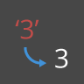

Strings
=======

Creating Strings
----------------

**String -** Formally, a String is a sequence of characters representing a literal constant or some type of variable. Informally, a string is programming lingo for text. We've worked with numbers, both integers and decimal numbers, to drive parameters and we can do the same with text.

<table>
<thead>
<tr class="header">
<th align="left">Icon</th>
<th align="left">Name</th>
<th align="left">Syntax</th>
<th align="left">Inputs</th>
<th align="left">Outputs</th>
</tr>
</thead>
<tbody>
<tr class="odd">
<td align="left"></td>
<td align="left">String</td>
<td align="left">String</td>
<td align="left">Text Box</td>
<td align="left">string</td>
</tr>
</tbody>
</table>

Strings can be used for a wide range of applications, including defining custom parameters, annotating documentation sets, and parsing through text-based data sets. The string Node is located in the Core&gt;Input Category.

 &gt; The sample batteries above are strings. A number can be represented as a string, as can a letter, or an entire array of text.

Querying Strings
----------------

You can parse through large amounts of data quickly by querying strings. We'll talk about some basic operations which can speed up a workflow and help for software interoperability.

**String.Split -**This action splits one string into an array of strings, based on a separator.

<table>
<thead>
<tr class="header">
<th align="left">Icon</th>
<th align="left">Name</th>
<th align="left">Syntax</th>
<th align="left">Inputs</th>
<th align="left">Outputs</th>
</tr>
</thead>
<tbody>
<tr class="odd">
<td align="left"></td>
<td align="left">String Split</td>
<td align="left">String.Split</td>
<td align="left">str, separator(s)</td>
<td align="left">string[]</td>
</tr>
</tbody>
</table>

The image below considers a string of data coming from an external spreadsheet. The string represents the vertices of a rectangle in the XY-Plane. Let's break down some string split operations in miniature exercise:

 &gt; 1. The ";" separator splits each vertex of the rectangle. This creates a list with 4 items for each vertex.

 &gt; 1. By hitting the "*+*" in the middle of the node, we create new separator. 2. Add a "*,*" string to the canvas and plug in to the new separator input. 3. Our result is now a list of ten items. The node first splits based on *separator0*, then based on *separator1*.

**String.ToNumber -** While the list of items above may look like numbers, they are still regarded as individual strings in Dynamo. In order to create points, their data type needs to be converted from a string to a number. This is done with the String.ToNumber node:

<table>
<thead>
<tr class="header">
<th align="left">Icon</th>
<th align="left">Name</th>
<th align="left">Syntax</th>
<th align="left">Inputs</th>
<th align="left">Outputs</th>
</tr>
</thead>
<tbody>
<tr class="odd">
<td align="left"></td>
<td align="left">String To Number</td>
<td align="left">String.ToNumber</td>
<td align="left">str</td>
<td align="left">str[]...[]</td>
</tr>
</tbody>
</table>

 &gt; 1. This node is straightforward. Plug the String.Split results into the input. The output doesn't look different, but the data type is now a *number* instead of a *string*.

 &gt; 1. With some basic additional operations, we now have a rectangle drawn at the origin based on the original string input.

Manipulating Strings
--------------------

Since a string is a generic text object, they host a wide range of applications. Let's take a look at some of the major actions in the Core&gt;String Category in Dynamo:

**Concatenate -**This is a method of merging two strings together in order. This takes each literal string in a list and creates one merged string.

<table>
<thead>
<tr class="header">
<th align="left">Icon</th>
<th align="left">Name</th>
<th align="left">Syntax</th>
<th align="left">Inputs</th>
<th align="left">Outputs</th>
</tr>
</thead>
<tbody>
<tr class="odd">
<td align="left"></td>
<td align="left">Concatenate</td>
<td align="left">String.Concat</td>
<td align="left">string(s)</td>
<td align="left">string</td>
</tr>
</tbody>
</table>

 &gt; The image above represents the concatenation of three strings: 1. Add or subtract strings to the concatenation by clicking the +/- buttons int he center of the node. 2. The output gives one concatenated string, with spaces and punctuation included.

**Join -** The join method is very similar to concatenate, except it has an added layer of punctuation.

<table>
<thead>
<tr class="header">
<th align="left">Icon</th>
<th align="left">Name</th>
<th align="left">Syntax</th>
<th align="left">Inputs</th>
<th align="left">Outputs</th>
</tr>
</thead>
<tbody>
<tr class="odd">
<td align="left"></td>
<td align="left">String Join</td>
<td align="left">String.Join</td>
<td align="left">separator, string (s)</td>
<td align="left">string</td>
</tr>
</tbody>
</table>

If you've worked in Excel, you may have come across a CSV file. This stands for comma-separated values. One could use a comma (or in this case, two dashes) as the separator with the join node in order to create a similar data structure:  &gt; The image above represents the joining of two strings: 1. The separator input allows one to create a string which divides the joined strings.
